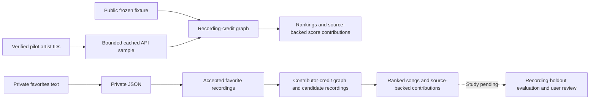

# Music-credit recommendations

Can contributor-credit relationships recommend useful songs from one person's
selected favorites? **Research result: pending.** The implementation now provides
conservative recording matching, contributor-based song ranking, bounded candidate
collection, and fixed-split evaluation tools under the revised [plan](plan.md).
Milestone 1 provides a small,
public, source-backed fixture to verify the graph and ranking arithmetic.
Milestone 2 adds a bounded, cached API sample with offline replay and source review.
The first 20-song matching run rule-accepted nine recordings; independent identity
audit and listening-quality evaluation remain pending. The approved study input is copied favorites
rather than the delayed Spotify export; see [DECISIONS.md](DECISIONS.md).

The supplied file contains **1,316 liked-song rows**. Milestone 4c now implements
resumable full-list matching, one consolidated scoring profile, broader contributor
discovery, automatic German Apple checks, and ordered playlist preparation.
**The MusicBrainz public API approach is not feasible for the intended full-library
matching, broad contributor discovery, and repeated experiments.** The scale-up run
was cancelled at the user's request on 2026-10-07, including its queued continuation.
The [cancellation and coverage report](reports/full_library_run.md) records the retained
partial results. A full-library recommendation list has not been produced.

## Full-library collection: public API approach discontinued

The first additional 100 rows took about 435 seconds and 320 HTTP attempts.
At cancellation, 538 rows had saved outcomes, including the 20-row pilot: 187
accepted recordings, 342 unresolved rows, and nine operational failures. One more
row was interrupted and 777 were not attempted. The run used 1,663 new MusicBrainz
HTTP attempts; broader discovery and Apple checks had not started. The earlier
estimate of another 2–4 hours for the full pipeline was a projection, not a completed
runtime measurement.

Serial [public-API rate limits](https://musicbrainz.org/doc/MusicBrainz_API/Rate_Limiting),
multiple searches and recording lookups per row, candidate expansion, and transient
HTTP 503 failures make this approach impractical for the project's intended scale
and iteration speed. Caching and checkpoints preserve progress but do not remove
the cost of fetching new neighborhoods. Bounded API pilots remain useful.

The next full-library approach should use a downloaded MusicBrainz database with
local indexes for matching and credit exploration. Importing the dump and adapting
the collector remain future work; this backend has not been implemented or benchmarked.
Apple availability checks remain a separate stage. See [D-024](DECISIONS.md#d-024-discontinue-public-api-full-library-collection).

Both collection processes are stopped. Completed row checkpoints, frozen responses,
and caches are preserved in the ignored private job directory. Inspect the cancelled
job without starting collection:

```bash
python3 -B -m src.process_library --output data/private/full_library_2026-10-07 --status
```

The following describes the implemented API experiment for reference; full-library
API collection is discontinued and there is no automatic continuation.

The complete workflow preserves D-015 matching, D-016 scores, and the existing
artist, musician, collaboration, contributor, and Apple constraints. Unknown rows
remain visible. Every accepted recording contributes once, with all of its original
source rows retained. Discovery seeks 500 eligible candidates and 100 explored
contributor routes across the full profile; the targets do not guarantee ten picks.

Pilot, seed-graph, Apple-snapshot, and policy-override imports must belong to their
declared input. The experimental collector uses private caches by default;
`--reuse-cache` explicitly selects the existing provider caches. `--fresh-apple`
uses a new job-local Apple cache and cannot import an old Apple snapshot.

The collector implements `--resume`, stage selection, and bounded failure retries;
changed inputs, rules, country, source imports, or cache policy are rejected.
`--offline` uses only frozen or cached responses. Individual pilot commands remain
compatible. The cancelled full-list job is retained as evidence, not scheduled to resume.

The declared stage ceilings are 16,000 matching, 6,000 discovery, and 2,000 Apple
HTTP attempts, including retries. Tranches contain at most 120, 120, and 60 attempts;
the workflow advances between them automatically. MusicBrainz and Apple retain
1.1- and 3.1-second minimum intervals. Each send is charged durably before transport.
Interrupted work resumes from row and operation checkpoints; budget exhaustion
retains partial results and reports an incomplete stage without increasing limits.

`coverage.json` identifies input, matching, credit, discovery, Apple, and list-size
denominators. The manifest points to immutable matching/discovery generations under
`snapshots/`. `exports_directory` identifies the current source-linked reviews,
four ranking reports, and playlist preparation; previous exports remain preserved.
`--verify-offline` reprocesses a completed job into `offline_replay/` and compares
profiles, recording snapshots, matching decisions, all four scoring outputs, selected
order, and playlist bytes with zero HTTP attempts. It publishes
`offline_verification.json` only after those comparisons pass. Partial collection
does not claim complete replay, independently audited precision, or listening quality.

## Worked example

This is the historical artist-ranking example; the song demo below ranks recording
IDs and preserves shared-contributor evidence for each suggested song.

With The Beatles as the fixture seed, Nathan East receives **one two-hop point**:

1. The Beatles (primary recording artist) and Eric Clapton (guest electric guitar)
   are both credited on
   [While My Guitar Gently Weeps, original mono studio mix](https://musicbrainz.org/recording/863288d1-0fb0-410f-ac45-98e0bd62eac1).
2. Eric Clapton (primary artist, guitar, resonator guitar, vocals) and Nathan East
   (bass) are both credited on
   [Tears in Heaven](https://musicbrainz.org/recording/21ddde6c-90f4-469e-bdd0-1f438d011917).

That pair of recordings contributes +1. East shares no fixture recording directly
with The Beatles, so his direct score is 0 and total is 1. These co-credits do not
establish that The Beatles and East met or worked directly together.

## Data flow

The public demos start at frozen recording snapshots. The historical artist pilot starts with
manually inspected artist IDs from favorites and expands selected co-credited
intermediaries. The song workflow matches private favorite recordings, retains
their contributor credits, and collects candidate recordings around those credits.



## What an edge means

In the song model, recordings connect to credited contributor entities. A shared
contributor supplies a path from a favorite recording to a candidate recording.
Credits retain their recording/work scope and source URLs; songwriting comes from
linked works. Groups remain entities and their members are never inferred. Primary
artist credits provide a musician-category proxy, separately reported from detailed
performance credits. Unknown roles remain in the audit with their mapping unresolved;
release-level credits are not inferred.

The historical artist projection uses a different edge definition:

Two distinct MusicBrainz artist entities have eligible credits on one recording.
The graph is undirected. Each edge retains its source recordings and each artist's
roles, attributes, and credit dates. Group entities remain separate from members;
a member needs their own eligible credit to appear on that recording.

Eligible roles are primary recording artists plus explicit recording-level
performer, instrument, vocal, producer, mixer, general engineer, audio engineer,
sound engineer, and recording engineer relationships. The ID allowlist is in
[config/graph_rules.yml](config/graph_rules.yml), using the
[MusicBrainz relationship definitions](https://musicbrainz.org/relationships/artist-recording).
The config uses the JSON subset of YAML 1.2, so the demo needs no YAML dependency.

Work-level writing, release-only credits, executive attributes, and relationships
outside the allowlist are excluded and audited. Multiple roles or credit dates
preserve evidence detail but do not create extra edge contributions for the same
pair and recording. Density is reported; no size cutoff is applied.

## Ranking methods

The song method adds one weight per distinct contributor role category on each
recording: musician **1**, songwriter **1**, producer **1**, and staff **0.25**.
These are fixed provisional weights, not learned importance. All musicians have the
same base weight; primary/instrument/vocal credits and multiple instruments do not
add extra musician units. A musician who also writes the song receives both categories.
The `equal` comparator sets every category to 1.

For each favorite/candidate pair, sum products of shared contributors' role weights,
then bound the sum `x` as `x / (1 + x)`. Within each primary favorite-artist group,
average these pair affinities over distinct favorite recordings and multiply by
`n / (n + 5)`. This bounds one artist's aggregate impact while retaining diminishing
influence from additional favorites. Multi-primary favorites contribute to each named
artist group. Scores are credit affinities, not preference probabilities.
All raw credits and transformations remain in the score contributions.
The [weight config](config/song_weights.json) exposes the assumptions;
`--no-saturation` supplies the linear accumulation comparator.

Song recommendations apply D-018 and D-020 before selecting a complete list:

- Exclude acts submitted anywhere in the full favorites input, including unmatched
  rows. Distinct aliases and side projects are allowed; true aliases still share
  their canonical musician identity. Alias exceptions require recorded evidence.
- Allow at most **one** familiar-artist collaboration across the whole list,
  including explicitly identified related performers. Require an unfamiliar
  primary act and detailed familiar-performer evidence or a reviewed collaboration.
  Ambiguous joint credits and samples remain pending review.
- Use each observed primary artist, vocalist, instrumentalist, or other performer
  only once. Production, writing, engineering, and artwork alone do not consume an
  appearance. A performer who also produces still consumes one.
- Select positive-score eligible songs deterministically and report skipped
  candidates and list shortfalls. A short pool never relaxes the hard rules.
- Use each **shared explanatory contributor only once per batch**, including
  producers, writers, and engineers. A song reserves all its connecting contributors.
  Nonconnecting staff do not consume this allowance; allowances reset each batch.

`--diversity contributors` remains accepted for compatibility, but the hard shared-
contributor cap makes its repeated-evidence penalty redundant. Base affinities and
source contributions remain unchanged. Historical D-019 reports describe the earlier
soft comparison and are not results under the current policy.

The original artist baselines remain available:

**Direct:** one point per distinct seed–candidate–recording combination.

**Two-hop:** direct score plus one point per seed–candidate–unordered pair of
different recordings connected through an intermediary. All three artists must
be distinct, and intermediaries cannot be seeds. Several intermediary paths or
both recording orientations still count as one recording-pair contribution; all
valid paths remain in the output. Separate seeds supply separate contributions.

For example, Billy Preston has 2 direct points plus 3 recording-pair points,
total **5**. Nathan East has 0 direct plus 1 recording-pair point, total **1**.
These are evidence counts, not probabilities or preference estimates.

Both methods use the same nonseed graph artists as candidates, including artists
with score zero in the direct baseline. Sort by descending score, case-insensitive
artist name, then MusicBrainz ID. All role weights are equal. A degree penalty is
a proposed later comparison and has not been implemented or tuned.

## Evaluation

No listener-preference evaluation has run. The evaluator requires complete-primary-
artist holdouts, keeping established equivalent release appearances together.
Same-artist song holdouts would normally be excluded by the discovery policy.
Methods must use shared fixed splits and report Recall@10/20 with overall and
reachable counts. Held-out favorites must not guide candidate collection.
Exclusion registries come from training records only. All four methods apply the
same hard constraints; raw-score and selected-list recovery are reported separately,
alongside list length, performer repetition, collaboration count, and contributor
concentration. Research mode also requires training-only exclusion provenance.
Final test splits must remain
untouched during rule selection. A small-data evaluation without independent
validation/test splits must be labeled exploratory.

The [milestone report](reports/results.md) contains fixture arithmetic and pilot
collection diagnostics. Neither is a holdout evaluation result.

## Failure analysis

- Eric Clapton has 17 fixture neighbors and connects The Beatles to ten artists
  on a single dense recording. Those suggestions are plausible graph paths,
  not evidence that this listener will like those artists.
- Tears in Heaven has 11 eligible artists and creates 55 edges. Capping repeated
  recording-pair evidence limits amplification but does not remove clique bias.
- Will Jennings is a work-level writer on Tears in Heaven and is excluded. This
  accurately follows the rule but leaves songwriting associations unrepresented.
- Missing recording credits cannot be repaired by promoting album credits or
  expanding a band's membership. This fixture cannot quantify that coverage loss.
- The real pilot reaches 85 additional candidate entities after expansion, but
  Cian Riordan's eligible credits are engineering roles, and The Alchemist's nine
  points include three versions of 1 Train. See the report's source paths and
  coverage limits; recording-page and independent human review remain pending.

## How to run it

From the repository root, with Python 3.12 or later, no installation or network is
needed:

```bash
python3 -m src.recommend --method direct
python3 -m src.recommend --method two-hop
python3 -m src.recommend --method two-hop --format json
python3 -m unittest discover -s tests -v
```

The offline song demo uses While My Guitar Gently Weeps as its favorite recording:

```bash
python3 -m src.recommend_songs
python3 -m src.recommend_songs --method equal --format json
python3 -m src.recommend_songs --no-saturation --format json
python3 -m src.evaluate_songs --split config/fixture_song_split.json
```

The evaluation example is labeled `demonstration_diagnostics`. Research mode
requires dataset collection provenance bound to the training recordings and rejects
training/held-out overlap, including explicitly established equivalent identities.
It does not establish unknown cross-ID equivalence or independently verify identity.

Text output shows every recommendation and its score contributions. JSON also
includes complete paths, roles, dates, source URLs, exclusions, recording density,
and artist degrees. Repeat `--seed MBID` to override the fixed fixture seed, or use
`--fixture DIRECTORY` for a directory with the same manifest/snapshot format.
Use `--sample DIRECTORY` for a collected sample; it uses the frozen graph rules
and validates recording snapshot checksums before ranking.
An empty seed list in the Python API returns no recommendations; unknown IDs are
rejected.

### Private favorites conversion

```bash
python3 -m src.parse_library copied_favorite_songs.txt --output data/private/favorites.json
```

The converter accepts `Artist — Song` lines and the observed eight-column tabular
layout (title, unlabeled, duration, artist, album, genre, unlabeled, unlabeled).
It retains original lines and all tabular columns, preserves repeated songs,
and puts malformed or ambiguous rows in `needs_review`. It does not infer artist
identities, interpret unlabeled columns, or match recordings. It refuses to
overwrite an existing output; keep reviewed files and choose a new output path
when reconverting. Private text, JSON, exports, and caches are ignored by Git.

### Real-data process

The four public snapshots remain frozen in [data/fixture](data/fixture).
The live pilot and raw API cache live in ignored directories. Seeds were chosen
before collection: Unknown Mortal Orchestra, Cate Le Bon, and Kendrick Lamar,
the three most frequent exact artist names in the private favorites. Artist-page
identity checks are separate from matching individual songs. Human review remains
pending. See D-010 and D-011 in [DECISIONS.md](DECISIONS.md).

The [fixed limits](config/sample_limits.json) allow eight first-page recordings
per seed, two intermediaries per seed, six additional recordings per intermediary,
one expansion round, and at most 100 HTTP attempts including retries. The frontier
uses distinct seed-recording evidence, with MBID tie-breaking. Artist lookups
request recording relationships to find performance and production credits;
primary-credit browse alone misses many producer/engineer recordings. Additional
recordings come from that union, sorted by MBID, excluding recordings already
collected. Each recording lookup explicitly includes artist credits, artist
relationships, and work relationships for exclusion review.

Create `data/private/sample_artists.json` with this structure when using your own
manually checked seeds (the synthetic placeholder below is **not** a real seed):

```json
{
  "format_version": 1,
  "selection_rule": "Describe how you selected seeds before fetching",
  "seeds": [{
    "id": "00000000-0000-4000-8000-000000000001",
    "name": "Manually verified artist name",
    "type": "Person",
    "verification": {"source_url": "Artist page you inspected", "reviewer": "Your name"}
  }]
}
```

Put your contact email or project URL in `data/private/musicbrainz_contact.txt`.
MusicBrainz requires an identifying User-Agent with contact information and at
most one request per second; the collector uses a 1.1-second minimum interval.
See [MusicBrainz's API guidance](https://musicbrainz.org/doc/MusicBrainz_API) and
[rate-limit guidance](https://musicbrainz.org/doc/MusicBrainz_API/Rate_Limiting).
The standard-library collector uses Linux file locking to serialize runs sharing
one cache, including across restarts. Coordinate other applications on the same IP.

```bash
python3 -m src.fetch_musicbrainz --contact-file data/private/musicbrainz_contact.txt --output data/private/pilot
python3 -m src.recommend --sample data/private/pilot --method two-hop --format json
python3 -m src.fetch_musicbrainz --offline --output data/private/pilot_replay
```

For the pilot already collected in this checkout, use
`data/private/musicbrainz_sample_2026-10-06` as the recommendation directory.
Every output directory must be new. Default seed and cache paths are reused;
override `--seeds`, `--limits`, and `--cache` when needed. Offline collection needs
no contact and never accesses the network. Successful and failed responses are
reused; `--retry-failures` explicitly enables retrying cached failures online.
The tool preserves a partial sample and exits with status 2 for recorded failures
or missing seeds. It does not silently claim a complete collection.

Each saved sample contains:

- `manifest.json`: seed provenance, retrieval dates, MBIDs, exact API queries,
  cache version, hashes, frozen rules, selected/omitted IDs, browse totals,
  failures, frontier evidence, graph counts, density, and before/after reachability.
- `recordings/`: frozen recording responses, separate from version-1 raw-text
  cache envelopes under `data/cache/musicbrainz/`.
- `recommendations_direct.json` and `recommendations_two-hop.json`: all score
  contributions with source recording IDs and roles; `exclusions.json` preserves
  ineligible artist credits and reasons.
- `REVIEW.md`: several paths with recording versions and excluded credits for
  independent human review. Example contributions are a subset of the full JSON.

Retrieval completeness under the declared limits is separate from graph coverage.
First browse pages are not random samples, and artist recording-relationship lists
have no paging interface; their completeness is not certified. Unqueried release
credits cannot be counted as observed exclusions. Missing credits and version-specific
recordings can limit discovery. Report poor coverage before increasing the bounds
or considering a dump. No full dump or additional source is part of this milestone.

### Recording matching and song candidate collection

The initial matching batch is in `data/private/recording_matches_2026-10-07/`.
It contains `matches.json`, deduplicated accepted `profile.json`, frozen recording
snapshots, `credit_audit.json`, `REVIEW.md`, and `reviews_template.json`. Of 20 songs,
9 met the automatic evidence rules, 4 need review, and 7 returned no results for
literal artist/title queries. These are collection diagnostics, not audited precision;
zero results do not establish absence from MusicBrainz.

The [matching rules](config/matching_rules.json) permit two 25-result search pages,
four recording lookups per song, and 120 HTTP attempts per run. Acceptance requires
one qualifying recording with exact normalized title/combined artist, a matching
album release, duration within 2 seconds, and no unresolved version markers.
Incomplete searches and uninspected exact alternatives cannot auto-accept a match.
Linked release lists can establish album presence; absence remains unknown.

Each output directory must be new. For a fresh copy of the initial workflow:

```bash
python3 -m src.match_recordings --selection data/private/matching_audit_2026-10-07/manifest.json --contact-file data/private/musicbrainz_contact.txt --output data/private/matches
python3 -m src.collect_song_graph --matches data/private/matches --policy-overrides data/private/discovery_policy_2026-10-07.json --contact-file data/private/musicbrainz_contact.txt --output data/private/song_graph
python3 -m src.recommend_songs --dataset data/private/song_graph --profile data/private/song_graph/profile.json --format json --review-output data/private/song_graph/SONG_REVIEW.md
```

Use `--offline` for matching or collection replay. The client preserves cached
failures and refuses corrupt entries. Request-budget exhaustion saves partial
results and exits with status 2. Larger matching batches can use `--start-row` and
`--row-limit` with a new output directory; the same per-run request cap applies.

For manual identity decisions, edit a copy of `reviews_template.json`, use status
`accepted` or `unresolved`, and record the reviewer and evidence. An acceptance must
name a fetched candidate for that source row. Rerun matching with `--reviews FILE`
into a new directory to apply those decisions. Both selection and review files are
bound to the original favorites hash, and reviewed decisions stay in the output.

New matching profiles retain a hash-bound full-input artist registry. Older
profiles require `--input data/private/favorites.json` during collection or ranking
to recover exclusions for unmatched rows. Policy overrides are private version-1
JSON bound to the same `input_sha256`; supported lists are `related_performers`
(`artist_id`), `group_members` (`group_id`, `member_id`), `allowed_aliases`
(`artist_id`, `credited_name`), and `verified_collaborations` (`recording_id`).
Every entry needs an `evidence` string. Overrides are frozen into the collected
profile and its registry checksum. The local discovery policy records the user's
explicit group/related-performer rule without inferring performance from membership.

The [song collector](config/song_collection_limits.json) selects up to twelve
contributors by round-robin allocation across favorite artists, preferring routes
beyond their own discographies. It retrieves up to six eligible recordings per
contributor, with at most eighteen detail lookups per contributor and 120 HTTP
attempts overall. Familiar solo recordings are filtered from browse metadata;
rejected detail lookups are replaced from the remaining pool. Detail requests
alternate across contributors. It uses recording relationships, two primary-credit
browse pages, and up to two songwriting-work lookups per contributor. Sources, page
offsets, exclusions, omissions, failures, and training recording IDs are frozen.
`--favorite MBID` selects accepted training recordings and rebuilds exclusions from
that subset alone for a later evaluation split.
This is a bounded convenience sample, not a complete neighborhood.

The collected song graph in this checkout is `data/private/song_graph_2026-10-07/`:
9 rule-accepted favorites and 36 candidate recordings. `SONG_REVIEW.md` provides ten
suggestions and source paths; the three `recommendations_*.json` files retain all
36 rankings. Independent identity and listening review remain pending.

The updated discovery graph is `data/private/song_graph_discovery_2026-10-07/`:
9 favorites and 44 eligible candidates, collected in 117 paced HTTP attempts.
Its historical D-019 weighted list returns ten songs with one familiar collaboration and zero
repeated observed musicians. `SONG_REVIEW_weighted.md` and
`SONG_REVIEW_weighted_contributor_diversity.md` expose the source paths and musician
sets. Offline collection replay uses zero requests. These are policy and collection
checks, not listening-quality measurements.

### Automatic Apple Music checks and playlist preparation

Milestone 4b uses Apple's free country-specific search API to automatically check the
entire eligible candidate pool before selecting a batch. **No developer membership
or routine manual confirmation is required.** Germany (`DE`) is the default.

```bash
python3 -B -m src.check_apple_music --dataset data/private/song_graph_discovery_2026-10-07 --profile data/private/song_graph_discovery_2026-10-07/profile.json --country DE --output data/private/apple_check
python3 -B -m src.recommend_songs --dataset data/private/song_graph_discovery_2026-10-07 --profile data/private/song_graph_discovery_2026-10-07/profile.json --availability data/private/apple_check/availability.json --country DE --format json --review-output data/private/apple_check/SONG_REVIEW.md --playlist-output data/private/apple_check/playlist_preparation.json
```

The checker requires a conservative credited-artist/title/version/duration match
and an explicit `isStreamable: true` response. It allows another album appearance
or an identified studio remaster, while retaining live/remix/edit and other version
distinctions. The duration tolerance is the existing fixed two-second assumption;
missing duration or uncertain identity cannot auto-qualify. Prefer an original
version, matching album context, closest duration, then the lowest track ID.

The [lookup rules](config/apple_lookup_rules.json) allow two distinct artist/title
queries per candidate, 50 results per query, 60 HTTP attempts including retries,
and at least 3.1 seconds between requests. Exact responses, query and response hashes,
retrieval dates, country, and the dataset fingerprint are saved privately. `--offline`
replays cached checks into a new output directory with zero network requests;
`--retry-failures` explicitly retries cached failures. A partial request failure or
budget exhaustion saves the report and exits with status 2. Output directories and
playlist files must be new. Existing cache successes retain their original retrieval
date; use a fresh `--cache` directory for a new live availability snapshot.

Uncertain matches, false or missing streaming flags, request failures, and unchecked
candidates are excluded before they can consume any contributor allowance. Selection
continues through the remaining pool and reports its shortfall. Omitting
`--availability` still produces contributor-constrained graph recommendations without
an Apple availability claim. Use `--country` consistently on checking, ranking, and
evaluation; country or dataset mismatches are rejected.

The review file supplies listening links and matching evidence. The ordered playlist
preparation JSON keeps iTunes IDs separate from future verified Apple Music catalog
IDs; it does not create a playlist in your account. Automatic account playlist
creation remains later work requiring Apple authorization.

The completed check in this checkout is
`data/private/apple_availability_complete_2026-10-07/availability.json`. Of 44 eligible
candidates, 15 have qualifying automatic streaming matches. The current weighted
batch selects **two songs**, with a shortfall of eight; the strict graph-only batch
selects seven. The equal-weight Apple-filtered comparison selects three. This reflects
the small pool and combined hard rules, not a measured preference improvement.
Listening links and credit paths are in
`data/private/apple_batch_complete_2026-10-07/SONG_REVIEW_weighted.md`; the same directory
contains `playlist_preparation.json`, all four comparison reports, and `verification.json`.
The completed lookup and every comparison replay with zero network requests.

These are **API-indicated streaming matches, not guaranteed playback**. The public
streaming flag is observed in current responses but absent from Apple's documented
response-key table, so missing flags fail closed. A failed search does not prove
catalog absence. Metadata matching is not proof of identical audio, and lookup dates
remain visible. [Apple search API](https://performance-partners.apple.com/search-api),
[Apple playlist API](https://developer.apple.com/documentation/applemusicapi/create-a-new-library-playlist).

## Limitations and next steps

This hand-selected fixture validates code behavior only. MusicBrainz credits can
be incomplete and version-specific. The eventual favorites list is selected by
one listener; absent artists are not negative preference labels. No conclusions
generalize to other listeners. The bounded sample exposes collection coverage and
traceable paths. A small real recording-matching run and song graph are now available;
full-list matching, the approximately 100-match identity audit, and listener-preference
evaluation remain pending. Engineers and producers supply song connections in the
new model; they remain artist candidates in the historical baselines.

Song recommendations now use equal musician-category weights, additive songwriting,
and saturated artist influence. The fixed numerical weights are provisional and
exposed in configuration; unmapped roles, release-level staff coverage, and cross-ID
recording equivalence remain unresolved. Detailed performer credits occur on only
2 of the 9 rule-accepted favorites; primary artist credit is a limited proxy for
musical contribution. D-012–D-019 of [DECISIONS.md](DECISIONS.md) record the direction,
identity policy, scoring assumptions, and bounded collection. D-020/D-021 add the
shared-contributor cap and automatic free Apple checks. No predictive-quality
claim is made from the fixture or these convenience samples.

## Contribution and tools

The user selected the study input, verified-credit fixture, milestone boundary,
recording-pair counting rule, and retrieval contact. Codex implemented the Python
code and collection workflow, inspected sources, checked arithmetic, and documented
sampling choices. An
independent human credit audit and the user's interpretation of real results
remain pending; neither is claimed as completed here.
