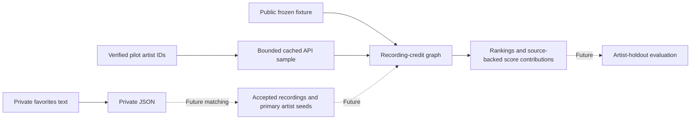

# Music-credit recommendations

Can recording-credit relationships recover artists hidden from one person's
selected favorites? **Research result: pending.** Milestone 1 provides a small,
public, source-backed fixture to verify the graph and ranking arithmetic.
Milestone 2 adds a bounded, cached API sample with offline replay and source review.
Neither measures recommendation quality. The approved study input is copied favorites
rather than the delayed Spotify export; see [DECISIONS.md](DECISIONS.md).

## Worked example

With The Beatles as the fixture seed, Nathan East receives **one two-hop point**:

1. The Beatles (primary recording artist) and Eric Clapton (guest electric guitar)
   are both credited on
   [While My Guitar Gently Weeps, original mono studio mix](https://musicbrainz.org/recording/863288d1-0fb0-410f-ac45-98e0bd62eac1).
2. Eric Clapton (primary artist, guitar, resonator guitar, vocals) and Nathan East
   (bass) are both credited on
   [Tears in Heaven](https://musicbrainz.org/recording/21ddde6c-90f4-469e-bdd0-1f438d011917).

That pair of recordings contributes +1. East shares no fixture recording directly
with The Beatles, so his direct score is 0 and total is 1. These co-credits do not
establish that The Beatles and East met or worked directly together.

## Data flow

The public demo starts at frozen recording snapshots. The local pilot starts with
manually inspected artist IDs from favorites and expands selected co-credited
intermediaries. Personal-text conversion is available; song matching and evaluation
are future milestones.



## What an edge means

Two distinct MusicBrainz artist entities have eligible credits on one recording.
The graph is undirected. Each edge retains its source recordings and each artist's
roles, attributes, and credit dates. Group entities remain separate from members;
a member needs their own eligible credit to appear on that recording.

Eligible roles are primary recording artists plus explicit recording-level
performer, instrument, vocal, producer, mixer, general engineer, audio engineer,
sound engineer, and recording engineer relationships. The ID allowlist is in
[config/graph_rules.yml](config/graph_rules.yml), using the
[MusicBrainz relationship definitions](https://musicbrainz.org/relationships/artist-recording).
The config uses the JSON subset of YAML 1.2, so the demo needs no YAML dependency.

Work-level writing, release-only credits, executive attributes, and relationships
outside the allowlist are excluded and audited. Multiple roles or credit dates
preserve evidence detail but do not create extra edge contributions for the same
pair and recording. Density is reported; no size cutoff is applied.

## Ranking methods

**Direct:** one point per distinct seed–candidate–recording combination.

**Two-hop:** direct score plus one point per seed–candidate–unordered pair of
different recordings connected through an intermediary. All three artists must
be distinct, and intermediaries cannot be seeds. Several intermediary paths or
both recording orientations still count as one recording-pair contribution; all
valid paths remain in the output. Separate seeds supply separate contributions.

For example, Billy Preston has 2 direct points plus 3 recording-pair points,
total **5**. Nathan East has 0 direct plus 1 recording-pair point, total **1**.
These are evidence counts, not probabilities or preference estimates.

Both methods use the same nonseed graph artists as candidates, including artists
with score zero in the direct baseline. Sort by descending score, case-insensitive
artist name, then MusicBrainz ID. All role weights are equal. A degree penalty is
a proposed later comparison and has not been implemented or tuned.

## Evaluation

No holdout evaluation has run. Future evaluation must hold out complete artists
and all their input tracks, use shared fixed splits for every method, and report
Recall@10/20 with overall and reachable counts. Final test splits must remain
untouched during rule selection. A small-data evaluation without independent
validation/test splits must be labeled exploratory.

The [milestone report](reports/results.md) contains fixture arithmetic and pilot
collection diagnostics. Neither is a holdout evaluation result.

## Failure analysis

- Eric Clapton has 17 fixture neighbors and connects The Beatles to ten artists
  on a single dense recording. Those suggestions are plausible graph paths,
  not evidence that this listener will like those artists.
- Tears in Heaven has 11 eligible artists and creates 55 edges. Capping repeated
  recording-pair evidence limits amplification but does not remove clique bias.
- Will Jennings is a work-level writer on Tears in Heaven and is excluded. This
  accurately follows the rule but leaves songwriting associations unrepresented.
- Missing recording credits cannot be repaired by promoting album credits or
  expanding a band's membership. This fixture cannot quantify that coverage loss.
- The real pilot reaches 85 additional candidate entities after expansion, but
  Cian Riordan's eligible credits are engineering roles, and The Alchemist's nine
  points include three versions of 1 Train. See the report's source paths and
  coverage limits; recording-page and independent human review remain pending.

## How to run it

From the repository root, with Python 3.12 or later, no installation or network is
needed:

```bash
python3 -m src.recommend --method direct
python3 -m src.recommend --method two-hop
python3 -m src.recommend --method two-hop --format json
python3 -m unittest discover -s tests -v
```

Text output shows every recommendation and its score contributions. JSON also
includes complete paths, roles, dates, source URLs, exclusions, recording density,
and artist degrees. Repeat `--seed MBID` to override the fixed fixture seed, or use
`--fixture DIRECTORY` for a directory with the same manifest/snapshot format.
Use `--sample DIRECTORY` for a collected sample; it uses the frozen graph rules
and validates recording snapshot checksums before ranking.
An empty seed list in the Python API returns no recommendations; unknown IDs are
rejected.

### Private favorites conversion

```bash
python3 -m src.parse_library copied_favorite_songs.txt --output data/private/favorites.json
```

The converter accepts `Artist — Song` lines and the observed eight-column tabular
layout (title, unlabeled, duration, artist, album, genre, unlabeled, unlabeled).
It retains original lines and all tabular columns, preserves repeated songs,
and puts malformed or ambiguous rows in `needs_review`. It does not infer artist
identities, interpret unlabeled columns, or match recordings. It refuses to
overwrite an existing output; keep reviewed files and choose a new output path
when reconverting. Private text, JSON, exports, and caches are ignored by Git.

### Real-data process

The four public snapshots remain frozen in [data/fixture](data/fixture).
The live pilot and raw API cache live in ignored directories. Seeds were chosen
before collection: Unknown Mortal Orchestra, Cate Le Bon, and Kendrick Lamar,
the three most frequent exact artist names in the private favorites. Artist-page
identity checks are separate from matching individual songs. Human review remains
pending. See D-010 and D-011 in [DECISIONS.md](DECISIONS.md).

The [fixed limits](config/sample_limits.json) allow eight first-page recordings
per seed, two intermediaries per seed, six additional recordings per intermediary,
one expansion round, and at most 100 HTTP attempts including retries. The frontier
uses distinct seed-recording evidence, with MBID tie-breaking. Artist lookups
request recording relationships to find performance and production credits;
primary-credit browse alone misses many producer/engineer recordings. Additional
recordings come from that union, sorted by MBID, excluding recordings already
collected. Each recording lookup explicitly includes artist credits, artist
relationships, and work relationships for exclusion review.

Create `data/private/sample_artists.json` with this structure when using your own
manually checked seeds (the synthetic placeholder below is **not** a real seed):

```json
{
  "format_version": 1,
  "selection_rule": "Describe how you selected seeds before fetching",
  "seeds": [{
    "id": "00000000-0000-4000-8000-000000000001",
    "name": "Manually verified artist name",
    "type": "Person",
    "verification": {"source_url": "Artist page you inspected", "reviewer": "Your name"}
  }]
}
```

Put your contact email or project URL in `data/private/musicbrainz_contact.txt`.
MusicBrainz requires an identifying User-Agent with contact information and at
most one request per second; the collector uses a 1.1-second minimum interval.
See [MusicBrainz's API guidance](https://musicbrainz.org/doc/MusicBrainz_API) and
[rate-limit guidance](https://musicbrainz.org/doc/MusicBrainz_API/Rate_Limiting).
The standard-library collector uses Linux file locking to serialize runs sharing
one cache, including across restarts. Coordinate other applications on the same IP.

```bash
python3 -m src.fetch_musicbrainz --contact-file data/private/musicbrainz_contact.txt --output data/private/pilot
python3 -m src.recommend --sample data/private/pilot --method two-hop --format json
python3 -m src.fetch_musicbrainz --offline --output data/private/pilot_replay
```

For the pilot already collected in this checkout, use
`data/private/musicbrainz_sample_2026-10-06` as the recommendation directory.
Every output directory must be new. Default seed and cache paths are reused;
override `--seeds`, `--limits`, and `--cache` when needed. Offline collection needs
no contact and never accesses the network. Successful and failed responses are
reused; `--retry-failures` explicitly enables retrying cached failures online.
The tool preserves a partial sample and exits with status 2 for recorded failures
or missing seeds. It does not silently claim a complete collection.

Each saved sample contains:

- `manifest.json`: seed provenance, retrieval dates, MBIDs, exact API queries,
  cache version, hashes, frozen rules, selected/omitted IDs, browse totals,
  failures, frontier evidence, graph counts, density, and before/after reachability.
- `recordings/`: frozen recording responses, separate from version-1 raw-text
  cache envelopes under `data/cache/musicbrainz/`.
- `recommendations_direct.json` and `recommendations_two-hop.json`: all score
  contributions with source recording IDs and roles; `exclusions.json` preserves
  ineligible artist credits and reasons.
- `REVIEW.md`: several paths with recording versions and excluded credits for
  independent human review. Example contributions are a subset of the full JSON.

Retrieval completeness under the declared limits is separate from graph coverage.
First browse pages are not random samples, and artist recording-relationship lists
have no paging interface; their completeness is not certified. Unqueried release
credits cannot be counted as observed exclusions. Missing credits and version-specific
recordings can limit discovery. Report poor coverage before increasing the bounds
or considering a dump. No full dump or additional source is part of this milestone.

## Limitations and next steps

This hand-selected fixture validates code behavior only. MusicBrainz credits can
be incomplete and version-specific. The eventual favorites list is selected by
one listener; absent artists are not negative preference labels. No conclusions
generalize to other listeners. The bounded sample exposes collection coverage and
traceable paths; conservative song matching and artist-holdout evaluation remain
later milestones. Engineers and producers remain candidates as well as
intermediaries; high scores count credits rather than identifying music to play.

## Contribution and tools

The user selected the study input, verified-credit fixture, milestone boundary,
recording-pair counting rule, and retrieval contact. Codex implemented the Python
code and collection workflow, inspected sources, checked arithmetic, and documented
sampling choices. An
independent human credit audit and the user's interpretation of real results
remain pending; neither is claimed as completed here.
