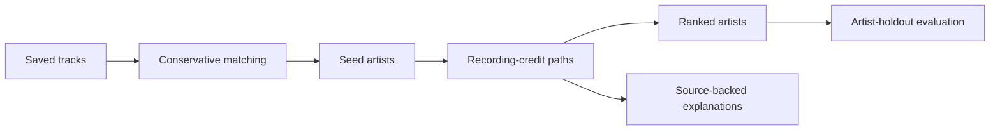

# Music-credit recommendations: implementation plan

## Purpose

Build a small, explainable data science portfolio project that tests this question:

> Can recording-credit relationships help recover artists hidden from one person's saved music library?

The project should demonstrate careful data modeling, an honest evaluation, and clear communication. A technical reviewer should be able to understand the method and challenge its assumptions without reading every source file.

This is a single-library case study. Do not claim that its results generalize to all listeners.

## Instructions for the coding agent

Follow this plan in order.

- Implement the smallest version that can answer the research question.
- Do not add a web app, REST API, authentication, cloud deployment, Neo4j, PageRank, or extra data sources.
- Do not download the full MusicBrainz dump at the start. Use a hand-checked fixture, then a cached real-data sample.
- Do not invent performance numbers, citations, recording credits, or recommendation explanations.
- Do not choose role weights or thresholds merely because they produce attractive examples.
- Keep private Spotify exports and downloaded data out of Git.
- Before making a major modeling or evaluation choice, record it in `DECISIONS.md`.
- After each milestone, report what works, what was checked, and what remains uncertain. Continue with the plan unless a choice would change the research question or substantially expand scope.
- If a result is disappointing, investigate and report it. Do not quietly change the evaluation to improve the number.

## What “done” looks like

The repository contains:

1. A quick, nonprivate demo that produces ranked artists and traceable explanations.
2. A documented MusicBrainz data snapshot.
3. A conservative matching audit for one Spotify library export.
4. Direct-credit and two-hop ranking baselines.
5. An artist-holdout evaluation with coverage and failure analysis.
6. A didactic README and a separate results report.
7. A decision log explaining the major choices and their consequences.

A polished interface is not required.

## Repository structure

```text
music-credit-recommender/
├── README.md
├── PLAN.md
├── DECISIONS.md
├── pyproject.toml
├── config/
│   └── graph_rules.yml
├── src/
│   ├── fetch_musicbrainz.py
│   ├── parse_library.py
│   ├── match_recordings.py
│   ├── build_graph.py
│   ├── recommend.py
│   └── evaluate.py
├── data/
│   ├── fixture/
│   └── sample_artists.txt
├── tests/
│   └── test_graph_and_ranking.py
└── reports/
    ├── results.md
    └── figures/
```

Use Python and a simple local data store. Add PostgreSQL only if the measured data size or queries require it; document that decision first.

## Decision log

Create `DECISIONS.md` at the beginning. Use one entry for each consequential choice:

```text
## D-001: Short title

Date:
Status: accepted / revised / rejected

Question:
What problem required a decision?

Options considered:
What were the reasonable alternatives?

Choice:
What did we choose, and why?

Evidence or assumption:
What observation supports the choice? What remains unverified?

Consequence:
What does this choice make easier, harder, or impossible?

How to check it:
What test, audit, or comparison could show that the choice was wrong?
```

Record at least these decisions:

- What a graph edge means.
- Which credit relationships are eligible.
- How duplicate and unusually dense recordings are handled.
- How ambiguous track matches are handled.
- How candidates are ranked and scored.
- How artists are held out for evaluation.
- Whether role weights or a degree penalty are justified.

The log should show genuine revisions when evidence changes a choice. Do not create entries merely to make the history look busy.

## Milestone 1: Define and verify a tiny graph

Create a hand-checked fixture with roughly 10–20 artists and several recordings. Include:

- A direct path.
- A two-hop path.
- Repeated evidence from more than one recording.
- A highly connected intermediary.
- A group artist.
- An ambiguous or ineligible relationship.

Define an edge as:

> Two MusicBrainz artist entities have eligible credits on the same recording.

This does **not** establish that they met or worked directly together. Explanations must say “both credited on [recording].”

For the first version, consider primary recording artists and selected recording-level performers, producers, mixers, and engineers. Keep work-level composer and lyricist relationships out of the main graph unless separately evaluated.

Implement ranking on the fixture and tests for the expected paths and score contributions.

**Completion check:** Every fixture edge can be traced to one recording and its roles. Every recommendation score can be calculated by hand.

## Milestone 2: Build a small real-data sample

Use the MusicBrainz API to obtain a bounded, reproducible sample around selected seed artists. Cache responses so runs do not repeatedly request the same data. Follow MusicBrainz API identification and rate-limit guidance.

Record:

- Retrieval date.
- MusicBrainz IDs.
- Source URLs or API queries.
- Cache format/version.
- Eligible and excluded relationship types.
- Counts of artists, recordings, credits, edges, and exclusions.

Inspect a sample of real edges manually. If the API sample proves too narrow for evaluation, explain the limitation before considering a database dump.

**Completion check:** A reviewer can trace several recommendations to actual MusicBrainz records.

## Milestone 3: Match one saved library

Parse one locally held Spotify `YourLibrary.json` format. This is a command-line import, not an upload service.

- Preserve original track and artist text.
- Normalize into separate fields.
- Match conservatively to MusicBrainz recordings.
- Mark uncertain cases for review rather than forcing a match.
- Convert accepted recordings into primary-artist seeds.
- Never commit the original export.

Manually inspect approximately 100 sampled matches, or all available matches if fewer than 100 exist. Report precision, coverage, sample size, and common failure types.

**Completion check:** The report states how many saved tracks became reliable artist seeds and how matching mistakes might affect recommendations.

## Milestone 4: Implement comparable ranking methods

Use the same graph, seeds, and candidate set for all methods.

1. **Direct-credit baseline:** Rank artists using direct eligible recording evidence shared with seed artists.
2. **Two-hop baseline:** Add paths through one intermediate artist, initially with equal role weights.
3. **Proposed variation:** Add a penalty for highly connected intermediaries. Add role weights only if their effect can be measured and defended.

Exclude artists already used as seeds. Limit repeated evidence from the same recording.

Store the score contributions and their source recordings. Generate explanations from those contributions, not with a separate after-the-fact query.

**Completion check:** For every displayed recommendation, the listed contributions sum to its score and each path has valid source evidence.

## Milestone 5: Evaluate honestly

Use the saved library as a **single-person case study**.

- Hold out complete artists, including all their saved tracks.
- Rank using only the remaining seed artists.
- Use fixed splits shared by every ranking method.
- Report Recall@10 and Recall@20.
- Report how many held-out artists are in the graph and reachable by each method.
- Show overall recall and recall among reachable artists separately.
- Keep final test splits untouched while choosing rules or weights.

Do not interpret an artist missing from the library as a disliked artist. Repeated splits of one library do not make this a multi-user study.

If there is too little data for separate validation and test splits, fix the method before evaluating and call the result exploratory.

**Completion check:** `reports/results.md` contains a baseline comparison with real counts, not only percentages.

## Milestone 6: Examine errors and assumptions

Inspect successful recoveries, misses, and highly ranked artists who were not held out. Identify whether each case relates to:

- Incorrect identity matching.
- Missing or uneven MusicBrainz credits.
- A prolific intermediary.
- A dense recording.
- The limits of saved artists as a preference signal.

Compare results with and without the degree penalty. If role weights were introduced, compare them with equal weights.

Document changes to graph rules or scoring in `DECISIONS.md`. Keep unsuccessful experiments in the report.

**Completion check:** The report explains at least one failure that the final method does not solve.

## README requirements

Write the README for a technical reader who has five minutes. Use plain language before formulas or implementation details.

Use this order:

1. **Question and result:** One short paragraph stating what was tested and what the measured result was.
2. **Worked example:** One real recommendation, its credited recordings, and its score contributions.
3. **Data flow:** Show how saved tracks become matched recordings, seed artists, graph paths, rankings, and evaluation.
4. **What an edge means:** Explain the eligible credits and the important limits of that definition.
5. **Ranking methods:** Explain the direct baseline, two-hop baseline, and proposed variation with a tiny numeric example.
6. **Evaluation:** Explain artist holdout, leakage prevention, coverage, and the result table.
7. **Failure analysis:** Show a few concrete examples.
8. **How to run it:** Give a short command sequence for the nonprivate fixture demo; put the slower real-data process in a separate section.
9. **Limitations and next steps:** State what this single-library study cannot establish.
10. **My contribution and tools:** Briefly state the decisions, audits, and interpretation I performed. If asked, describe Codex's implementation assistance plainly.

Use one small diagram **only if it clarifies the data flow**. A Mermaid diagram like this is sufficient; avoid a large decorative network visualization:



Do not put an unmeasured result or a hand-picked fixture result in the opening paragraph. Until evaluation is complete, label the result “pending.”

## Final review

Before calling the project recruiter-ready, check:

- Can I explain every major choice in `DECISIONS.md`?
- Can I trace each example recommendation to source recordings?
- Does the evaluation avoid artist leakage?
- Are baseline and proposed results calculated on the same splits?
- Are counts and limitations visible beside the headline metric?
- Can someone run the fixture demo without my private data?
- Does the README explain the study before discussing tools?
- Can I defend the result aloud without relying on Codex?

The final portfolio claim must be narrow and based on the measured findings.