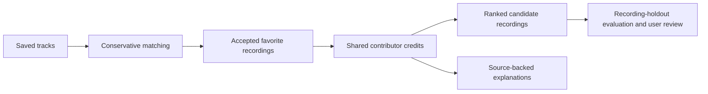

# Music-credit song recommendations: implementation plan

## Purpose

Build a small, explainable data science portfolio project that tests this question:

> Can contributor-credit relationships recommend useful songs from one person's selected favorites?

Song recommendations from acts absent from the submitted favorites are the primary
output, subject to the alias, side-project, and collaboration exceptions in D-018.
The input is the locally converted favorites list, as
approved in D-008. The implemented Milestone 1–2 artist graph and rankings remain
historical baselines; subsequent milestones retain recordings as preference inputs
and recommendation candidates. This plan was revised on 2026-10-07 following the
user's clarifications in D-012/D-013, D-018, and D-020/D-021, then on 2026-10-08
for the fresh bounded prototype in D-025.

All musicians have the same base weight. A contributor who is also credited as a
songwriter receives a separate, additive songwriting contribution. Do not infer
creative importance from fame, billing, lead/guest labels, or group membership.
Engineering and other staff credits remain relevant; their proposed lower weights,
production weights, numerical ratios, and role mapping require explicit design and
comparison. Preserve observed roles and source scope before scoring them. Many
favorites from one artist must have bounded aggregate influence; the saturation
function and parameters remain to be selected.

The project should demonstrate careful data modeling, an honest evaluation, and clear communication. A technical reviewer should be able to understand the method and challenge its assumptions without reading every source file.

This is a single-library case study. Do not claim that its results generalize to all listeners.

## Instructions for the coding agent

Follow this plan in order.

- Implement the smallest version that can answer the research question.
- Do not add a web app, REST API, authentication, cloud deployment, Neo4j, PageRank, or extra credit sources. D-021 permits a narrow Apple availability lookup; it does not supply credit evidence or scoring features.
- Do not download the full MusicBrainz dump at the start. Use a hand-checked fixture, then a cached real-data sample.
- Do not invent performance numbers, citations, recording credits, or recommendation explanations.
- Do not choose role weights or thresholds merely because they produce attractive examples.
- Keep private Spotify exports and downloaded data out of Git.
- Before making a major modeling or evaluation choice, record it in `DECISIONS.md`.
- After each milestone, report what works, what was checked, and what remains uncertain. Continue with the plan unless a choice would change the research question or substantially expand scope.
- If a result is disappointing, investigate and report it. Do not quietly change the evaluation to improve the number.

## What “done” looks like

The repository contains:

1. A quick, nonprivate demo that produces ranked recordings and traceable explanations, alongside the existing artist demo.
2. A documented MusicBrainz data snapshot.
3. A conservative recording-matching and credit-coverage audit for one private favorites list.
4. Comparable song-ranking methods based on shared contributors, with documented role weighting and artist saturation.
5. A song-holdout evaluation for artist discovery, with coverage, list-constraint checks, and failure analysis.
6. A didactic README and a separate results report.
7. A decision log explaining the major choices and their consequences.

A polished interface is not required.

## Repository structure

```text
music-credit-recommender/
├── README.md
├── plan.md
├── DECISIONS.md
├── pyproject.toml
├── config/
│   └── graph_rules.yml
├── src/
│   ├── fetch_musicbrainz.py
│   ├── parse_library.py
│   ├── match_recordings.py
│   ├── build_graph.py
│   ├── recommend.py
│   └── evaluate.py
├── data/
│   ├── fixture/
│   └── private/                 # ignored favorites, matches, and audits
├── tests/
│   └── test_graph_and_ranking.py
└── reports/
    ├── results.md
    └── figures/
```

Use Python and a simple local data store. Add PostgreSQL only if the measured data size or queries require it; document that decision first.

## Decision log

Create `DECISIONS.md` at the beginning. Use one entry for each consequential choice:

```text
## D-001: Short title

Date:
Status: accepted / revised / rejected

Question:
What problem required a decision?

Options considered:
What were the reasonable alternatives?

Choice:
What did we choose, and why?

Evidence or assumption:
What observation supports the choice? What remains unverified?

Consequence:
What does this choice make easier, harder, or impossible?

How to check it:
What test, audit, or comparison could show that the choice was wrong?
```

Record at least these decisions:

- What a graph edge means, including contributor-credit edges for song ranking.
- Which credit relationships are eligible.
- How duplicate and unusually dense recordings are handled.
- How ambiguous track matches are handled.
- How candidates are ranked and scored.
- How recordings and their equivalent release appearances are held out for evaluation.
- How equal musician weights, additive songwriting, and artist saturation are defined.
- Whether a contributor-degree penalty or final-list diversity is justified.

The log should show genuine revisions when evidence changes a choice. Do not create entries merely to make the history look busy.

## Milestone 1: Define and verify a tiny graph

Implemented historical artist baseline. Independent human source review remains pending.

Create a hand-checked fixture with roughly 10–20 artists and several recordings. Include:

- A direct path.
- A two-hop path.
- Repeated evidence from more than one recording.
- A highly connected intermediary.
- A group artist.
- An ambiguous or ineligible relationship.

Define an edge as:

> Two MusicBrainz artist entities have eligible credits on the same recording.

This does **not** establish that they met or worked directly together. Explanations must say “both credited on [recording].”

For the first version, consider primary recording artists and selected recording-level performers, producers, mixers, and engineers. Keep work-level composer and lyricist relationships out of the main graph unless separately evaluated.

Implement ranking on the fixture and tests for the expected paths and score contributions.

**Completion check:** Every fixture edge can be traced to one recording and its roles. Every recommendation score can be calculated by hand.

## Milestone 2: Build a small real-data sample

Collection and offline replay are implemented. Independent human review remains pending.

Use the MusicBrainz API to obtain a bounded, reproducible sample around selected seed artists. Cache responses so runs do not repeatedly request the same data. Follow MusicBrainz API identification and rate-limit guidance.

Record:

- Retrieval date.
- MusicBrainz IDs.
- Source URLs or API queries.
- Cache format/version.
- Eligible and excluded relationship types.
- Counts of artists, recordings, credits, edges, and exclusions.

Inspect a sample of real edges manually. If the API sample proves too narrow for evaluation, explain the limitation before considering a database dump.

**Completion check:** A reviewer can trace several recommendations to actual MusicBrainz records.

## Milestone 3: Match favorite recordings and audit contributor coverage

Implementation status: The conservative matching CLI and first 20-song live batch
are implemented, with nine rule-accepted recordings. Independent review, full-list
matching, and the approximately 100-match precision audit remain pending.
Milestone 4c implements a resumable collector, but its full-list API run was cancelled
under D-024 because public-API collection is impractical at the intended scale.
Full-list matching and independent identity auditing remain incomplete.

Use the approved private `data/private/favorites.json`. The existing converter
preserves artist, title, album, duration, source columns, and original lines.

Begin with a 20-song review batch before scaling collection: the five favorites
with artist/title candidates in the frozen API pilot plus 15 songs from distinct
remaining artist-text entries spread across their sorted names. This is a workflow
and ambiguity audit, not a random sample or a matching-precision estimate. D-014
records its selection and review status. Cached text overlap proposes candidates;
it does not accept recording identities.

- Define an auditable match record retaining source row references, original text,
  album/duration/version context, candidate recording MBIDs, query/source hashes,
  acceptance evidence, uncertainty, and review status.
- Keep accepted, ambiguous, no-result, and not-searched cases separate. A MusicBrainz
  search score or matching title is insufficient evidence for acceptance.
- Use artist, title, album, duration, and explicit version evidence together.
  Do not infer that equal titles establish equal audio or merge all recordings of a work.
- Fetch exact candidate recordings through the cache. Preserve performer,
  production, engineering, and linked-work songwriting credits with relationship
  IDs, attributes, source scope, and provenance. Do not promote release-level credits
  to recording-level facts or expand group membership.
- Retain recording identities as preference inputs. Primary-artist IDs are context
  for aggregation and discovery, not a replacement for accepted recordings.
- Count repeated release appearances of an established recording once. Preserve
  separate live/remix candidates and uncertain mix/edit equivalences under D-013.
- Record credit presence and missing or unsupported roles separately from match quality.
- Keep favorites, fetched data, match records, review notes, and contact metadata private.

Use a predeclared cached request budget and rate limits for each live collection
batch. Start collection at favorite recordings. Later candidate expansion uses
contributors' eligible recording relationships and paginated primary-credit browse
under explicit stopping limits, preserving uncollected counts and selection evidence.

After the initial workflow audit, inspect approximately 100 matches selected under
a documented sampling rule, or all available matches if fewer exist. Report the
audit denominator, acceptance precision, coverage, sample size, ambiguity, and common
failure types. Human review remains pending until actually performed.

**Completion check:** A reviewer can trace accepted favorite recording identities
and their contributors to sources, see unresolved alternatives, and understand the
measured identity and credit coverage. Accepted recordings can feed a song-ranking
model without losing version or role information.

## Milestone 4: Implement comparable ranking methods

Implementation status: Equal and role-aware song scoring, artist saturation,
input-artist exclusion, one global familiar-collaboration allowance, musician
uniqueness, an optional contributor-diversity comparison, and a balanced collector
are implemented. The latest discovery graph contains 44 eligible candidates.
Numerical weights are fixed provisional assumptions under D-016; listening review
and empirical comparisons remain pending.

The D-018 discovery rules are implemented under D-019. The design and regression
cases remain in `reports/recommendation_policy_plan.md`. All four scoring methods
returned ten compliant songs on the new real graph under historical D-019;
Milestone 4b applies the stricter D-020 cap. Listening usefulness is pending.

Retain recordings and contributor entities, joined by role-bearing credit edges.
Rank candidate recordings through shared contributors with accepted favorite
recordings. Work-level songwriting must retain its linked-work provenance. Use the
same training favorites, graph, candidate recordings, and split for every comparison.

1. **Equal-weight song baseline:** Score shared contributor evidence while deduplicating repeated credits and established recording appearances.
2. **Role-aware song method:** Give every musician the same base weight; distinct songwriting adds a contribution. Document production and staff weights and both recordings' roles, without guessing creative importance.
3. **Artist saturation:** Normalize aggregate evidence from one favorite artist before applying a bounded preference weight. Distinct favorites can strengthen preference with diminishing influence; repeated editions or duplicate input do not strengthen it.
4. **Required candidate eligibility:** Exclude acts submitted anywhere in the favorites input, retaining explicit distinct-alias and side-project exceptions. Permit at most one verified familiar-artist collaboration across the entire list, including explicitly identified related performers.
5. **Required list selection:** Use every observed active-musician identity at most once across recommendations. Primary artist, instrument, vocal, and performer credits consume this allowance; nonperformance alone does not. Under D-020, independently limit every shared explanatory contributor to one selected song per batch, regardless of role. The old soft-diversity option remains compatible but is redundant under this cap.
6. **Balanced collection:** Replace raw favorite-count frontier priority with allocation across favorite-artist groups. Refill from eligible candidates under a declared request budget and record exclusions, coverage, and any list shortfall.
7. **Optional later comparisons:** Contributor-degree penalties, justified by measured results.

Exclude accepted favorite recording identities and established equivalents from
recommendation candidates. Apply input-artist exclusions and list constraints under
D-018; other songs by familiar acts are no longer ordinarily eligible. Unknown
cross-ID equivalence remains reviewable. Avoid summing duplicate instrument or role
rows as independent evidence; retain the raw credit detail for explanations.

Store the score contributions and their source recordings. Generate explanations from those contributions, not with a separate after-the-fact query.

**Completion check:** For every displayed recommendation, the listed contributions
sum to its base score and each path has valid source evidence. The complete list
passes input-artist exclusion, the one-collaboration allowance, and musician
uniqueness checks. Record selection adjustments and skipped candidates separately.

## Milestone 4b: Diverse batches with automatic Apple Music checks

Implementation status: D-020/D-021 add a hard one-song cap per shared contributor,
a separate cached free Apple checker, optional ranking/evaluation availability
inputs, source-linked listening reports, and an ordered playlist preparation export.
Bounded live results and remaining limitations are recorded in `reports/results.md`.

- Preserve raw affinities, role weights, saturation, unfamiliar-act exclusions,
  musician uniqueness, and the one global collaboration allowance.
- Every selected song reserves all its shared explanatory contributors across
  favorites and roles. Reset allowances between batches; concentrated-input
  exceptions are deferred. Return fewer songs with explicit reasons when needed.
- Automatically check eligible candidates against Apple's free search API in `DE`.
  Require a conservative artist/title/version match, known duration within two
  seconds, and explicit boolean `isStreamable=true`. Permit alternative album
  appearances and studio remasters; retain other version distinctions.
- Use at most two distinct queries per candidate, 50 results per query, 60 HTTP
  attempts including retries, and at least 3.1 seconds between requests. Freeze
  responses, country, timestamps, rules, hashes, and dataset fingerprints. Preserve
  partial failures and support offline replay.
- Availability filtering precedes list selection and consumes no allowances for
  rejected candidates. Unknown matches and streaming flags are skipped automatically;
  routine manual confirmation is not part of this milestone.
- Report coverage and exclusion reasons separately from recommendation quality.
  All scoring comparisons share the hard rules and optional availability input.
- Export an ordered playlist preparation file with iTunes IDs and listening links.
  Verified Apple Music catalog IDs, account authorization, and actual account playlist
  creation remain later work; do not purchase developer membership for this milestone.

**Completion check:** Synthetic regressions and the full suite pass; a bounded live
check of the existing 44-candidate pool yields a source-linked batch whose songs
all meet D-020 and have API-indicated streaming matches. Preserve shortfall counts
and reproduce matching and selection from cache with zero network requests.

## Milestone 4c: Process the full liked list and broaden discovery

Implementation status: The resumable workflow, full-profile consolidation,
persistent broad discovery, incremental Apple checks, four ranking exports, and
automatic offline verification are implemented under D-022/D-023. The full-list API
run and queued continuation were cancelled at the user's request under D-024.
The MusicBrainz public API approach is not feasible for the intended full-library
matching and broad-discovery workflow. Matching has 538 saved row outcomes; discovery,
expanded Apple checks, final exports, and complete live replay did not run.
Milestone completion requires a revised collection backend. Preserved partial
coverage is in [the cancellation report](reports/full_library_run.md).
The historical API implementation and validation sequence is in
[the full-library implementation plan](reports/full_library_implementation_plan.md).

Downloaded MusicBrainz data and local indexes were considered after cancellation
and remain deferred. The active direction is Milestone 4d below. Do not restart
the cancelled full-list experiment or change its evidence. The original full-library
objectives below remain outstanding.

- Account for every one of the 1,316 supplied rows with resumable, source-bound
  matching. Reuse the pilot/cache, preserve uncertain outcomes, and merge all
  accepted recordings into one deduplicated preference profile.
- Add persistent operation checkpoints and cumulative budgets so interruptions
  and successive bounded tranches do not restart collection or lose progress.
- Build contributor discovery from every accepted favorite, replacing the fixed
  twelve-route sample with balanced breadth across the full observed frontier.
  Aim for 500 eligible candidates and 100 explored routes where evidence and the
  declared limits permit; preserve unexpanded route counts.
- Recheck all candidates with automatic German Apple lookup, bind availability
  to the consolidated dataset, and retain the existing raw scoring and hard rules.
- Publish input/matching/credit/discovery/Apple coverage separately from final
  batch size. Every displayed batch must identify how much of the supplied list
  actually contributes to its scores.

**Completion check:** All supplied rows have attempted outcomes, every confidently
accepted favorite feeds scoring, and the broader graph and available batch replay
offline. Return up to ten songs with exact exclusion and shortfall counts. Missing
identities and credits do not prevent automatic processing, but remain visible;
independent precision and listening-quality evaluation remain later requirements.

## Milestone 4d: Fast live recommendations and seed experiments

Implementation: `src.quick_recommend.recommend_from_likes` and
`src.benchmark_recommendations.run_experiments`, under D-025. The input is the
existing parsed favorites JSON. Website and deployment work remain deferred.

- Start each run with fresh MusicBrainz responses. Defaults: random seed supplied
  by the caller, 8 artist groups, up to 15 recommendations, 35 HTTP attempts,
  and a 55-second per-run budget.
- Normalize credited-artist text, deduplicate identical artist/title/album/duration
  rows, weight artist groups 1/2/3 for 1/2–10/>10 songs, sample without replacement,
  and choose one song uniformly per sampled artist. Stable ordering reproduces
  sampling with the same random seed; weights do not change credit scores.
- Allow one 25-result search page and one detail lookup per seed. Reject capped
  searches without replacement. Under D-026, choose one plausible version by album
  context, known/closest duration, then stable recording ID; preserve alternatives
  and the choice reason. Existing detail checks still apply. Supplied recording MBIDs
  skip search; preserve existing identity checks.
- Expand contributors once in an order balanced across accepted favorite artists.
  Use one artist-relationship lookup, one artist browse page, and at most one
  songwriting-work route per contributor. Ingest recording and nested work credits
  from supported browse responses; bound individual fallbacks by the same budgets.
- Deduplicate requests and recordings within a run, admit at most 100 candidates,
  and stop once a compatible list reaches the requested size or collection ends.
  Preserve full-input familiar-act exclusions, favorite exclusions, observed performer
  uniqueness, and the existing familiar-collaboration allowance.
- In this prototype, permit repeated explanatory producers/writers/engineers with
  the existing `1 / (1 + previous selected appearances)` adjustment. Export unchanged
  base scores and adjusted selection scores. Existing workflows remain strict.
- Use a cancellable process, a collection deadline five seconds before the total
  budget, and request timeouts of at most five seconds or remaining collection time.
  Preserve completed snapshots, charge attempts before sending, disable automatic
  retries, honor provider backoff, and retain 1.1-second spacing between fresh runs.
- Export ordered recommendations, explanations, sampling/matching outcomes, partial
  coverage, request counts by operation, stage timings, elapsed time, and stopping
  reasons to JSON and a readable review. Empty and shorter lists are valid outcomes.
- Run a sequential grid of random seeds, seed counts, and repeat counts with fresh
  evidence each time. Export individual runs and CSV/JSON runtime, coverage, and
  recording-ID overlap summaries. The deadline applies per run, not to the batch.
- Extend the separate Apple checker to check only selected songs in an exported
  run, preserving all songs and their order. Missing matches mean no confident Apple
  match, not established absence; the initial list has no Apple requests or filter.

**Completion check:** The existing offline suite and targeted sampling, batching,
matching, policy, request-budget/pacing, separate Apple, and genuinely stalled
transport tests pass. Benchmark fresh runs against the under-60-second target and
report counts and shortfalls without claiming recommendation-quality improvements.
See [the benchmark report](reports/quick_recommendation_benchmark.md).

## Milestone 4e: Simplify matching and balance recommendations across seed songs

Status: planned; implementation and new benchmarks have not started. Detailed
handoff: [simpler matching and seed diversity](reports/fast_matching_and_seed_diversity_plan.md).

- Fix fast-mode matching first, targeting at least 90% of sampled songs matched.
  Use normalized song/main-artist identity; album, duration, and release versions
  guide representative-recording choice. Allow compatible results from capped
  search pages and a bounded fallback query. Keep historical matching conservative.
- At the default 35-attempt limit, allow at most 20 matching attempts and reserve
  at least 15 for discovery. Keep the 55-second runtime budget, fresh responses,
  request accounting/pacing, and separate Apple checking.
- Separate accepted identities from observed contributor coverage. Explore seeds
  in request rounds; deduplicate shared routes and retain per-seed diagnostics.
- Select one result per productive seed before second appearances, at most two
  per source-song group, targeting at least three represented groups. Deduplicate
  known compositions and preserve performer/familiar-artist rules and base scores.
- Measure matching on at least 100 fixed distinct sampled rows, then repeat the
  three random-seed 3/4/5 recommendation runs. Report match/coverage shortfalls,
  complete runtimes, and test results without claiming recommendation quality.

## Milestone 5: Evaluate honestly

Implementation status: Complete-artist fixed-split evaluation, constrained-list
comparisons, training-only registry validation, and leakage checks are implemented.
Only demonstration diagnostics have run; no favorites holdout or listening-quality
result has been measured.

Use the saved library as a **single-person case study**.

- Primary evaluation holds out complete primary-artist groups and their recording
  identities, keeping established equivalent release appearances together. Tracks
  by artists remaining in training would normally be excluded by D-018 and are
  unsuitable targets for the ordinary discovery task. Keep uncertain artist and
  version equivalences visible and report their possible leakage effect.
- Build preferences and candidate-retrieval decisions using only training favorites.
  Held-out favorite membership must not guide collection or matching-rule tuning.
- Build each evaluation exclusion registry from its training input only, without
  adding held-out artist names. Keep every ranking method under the same candidate
  and list constraints; evaluate the final selected list as well as raw ranking.
- Use fixed splits shared by every ranking method.
- Report Recall@10 and Recall@20.
- Report how many held-out recordings are in the candidate graph and reachable by each method.
- Show overall recall and recall among reachable recording identities separately.
- Report policy eligibility, repeated active musicians, familiar collaborations,
  source-contributor concentration, and the number of returned recommendations.
- Report repeated explanatory contributors, availability exclusions, and graph-
  reachable versus availability-reachable target denominators separately. Use the
  same country-specific availability snapshot and hard constraints across methods.
- Keep final test splits untouched while choosing rules or weights.

Do not interpret a recording or artist absent from favorites as disliked. Holding
out songs estimates recovery of saved preferences, not subjective usefulness of
unseen songs; complement it with a separate user review of recommendations.
Repeated splits of one favorites list do not make this a multi-user study.

If there is too little data for separate validation and test splits, fix the method before evaluating and call the result exploratory.

**Completion check:** `reports/results.md` contains a baseline comparison with real counts, not only percentages.

## Milestone 6: Examine errors and assumptions

Inspect successful recoveries, misses, and highly ranked recordings that were not held out. Identify whether each case relates to:

- Incorrect identity matching.
- Missing or uneven MusicBrainz credits.
- A prolific intermediary.
- A dense recording.
- Repeated versions or album/artist clusters dominating recommendations.
- Missing or overinterpreted credit roles.
- The limits of saved songs as a preference signal.

Compare equal and role-aware scoring, with and without artist saturation. Compare
degree penalties or final-list diversity only if implemented, using shared splits.

Document changes to graph rules or scoring in `DECISIONS.md`. Keep unsuccessful experiments in the report.

**Completion check:** The report explains at least one failure that the final method does not solve.

## README requirements

Write the README for a technical reader who has five minutes. Use plain language before formulas or implementation details.

Use this order:

1. **Question and result:** One short paragraph stating what was tested and what the measured result was.
2. **Worked example:** One real recommendation, its credited recordings, and its score contributions.
3. **Data flow:** Show how favorites become accepted recordings, contributor credits, candidate recordings, rankings, and evaluation.
4. **What an edge means:** Explain contributor roles, their recording/work/release scope, and the limits of credit evidence. Label the existing artist projection as a historical baseline.
5. **Ranking methods:** Explain equal musician weights, additive songwriting, other role weights, and artist saturation with a tiny numeric example.
6. **Evaluation:** Explain recording holdout, version leakage prevention, coverage, user review, and any separate artist-discovery result.
7. **Failure analysis:** Show a few concrete examples.
8. **How to run it:** Give a short command sequence for the nonprivate fixture demo; put the slower real-data process in a separate section.
9. **Limitations and next steps:** State what this single-library study cannot establish.
10. **My contribution and tools:** Briefly state the decisions, audits, and interpretation I performed. If asked, describe Codex's implementation assistance plainly.

Use one small diagram **only if it clarifies the data flow**. A Mermaid diagram like this is sufficient; avoid a large decorative network visualization:



Do not put an unmeasured result or a hand-picked fixture result in the opening paragraph. Until evaluation is complete, label the result “pending.”

## Final review

Before calling the project recruiter-ready, check:

- Can I explain every major choice in `DECISIONS.md`?
- Can I trace each example recommendation to source recordings?
- Does the evaluation keep equivalent recording appearances together and avoid held-out favorites guiding collection?
- Are baseline and proposed results calculated on the same splits?
- Are counts and limitations visible beside the headline metric?
- Can someone run the fixture demo without my private data?
- Does the README explain the study before discussing tools?
- Can I defend the result aloud without relying on Codex?

The final portfolio claim must be narrow and based on the measured findings.
